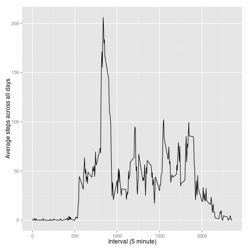

# Reproducible Research: Peer Assessment 1


## Loading and preprocessing the data


```r
        unzip("activity.zip")
        dfRead = read.csv("activity.csv", sep = ",", header=T)
        
        # Calculating sum
        agStepsSum = aggregate(steps ~ date, data=dfRead, sum)
        names(agStepsSum) = c("date","steps")        
```

## What is mean total number of steps taken per day?

```r
        # Histogram of steps
        hist(agStepsSum$steps, col = "green", breaks=10)
```

 

```r
        # Calculating mean
        mean(agStepsSum$steps, na.rm=T)
```

```
## [1] 10766.19
```

```r
        # Calculating median
        inMedian = median(agStepsSum$steps, na.rm=T)
        inMedian
```

```
## [1] 10765
```


## What is the average daily activity pattern?

```r
        agStepsMeanInt = aggregate(steps ~ interval, data=dfRead, mean, na.rm=T)
        names(agStepsMeanInt) = c("interval","steps")

        dfMaxDayMean = agStepsMeanInt[which.max(agStepsMeanInt$steps), ]

        # Time to plot
        library(ggplot2)
        ggplot(agStepsMeanInt, aes(x=interval, y=steps)) + 
                geom_line() + 
                xlab("Interval (5 minute)") + 
                ylab("Average steps across all days")
```

 
The interval with maximum number of average steps is interval number 835 and it contains on average maximum number of  steps.

## Imputing missing values

```r
        inNas = sum(is.na(dfRead))
```
The number of missing values is **2304**.

For imputing missing values I'll use median of an entire dataset

```r
        # First let's make a copy to work with
        dfReadImpute = dfRead
        
        # Now we set that to the median which was previously calculated
        dfReadImpute[is.na(dfReadImpute$steps),]$steps = inMedian

        # We do the computation again
        agStepsSumImpute = aggregate(steps ~ date, data=dfReadImpute, sum)
        names(agStepsSumImpute) = c("date","steps")

        # Creating histogram
        hist(dfReadImpute$steps, col = "green", breaks=20)
```

 

```r
        # Printing out mean values before and after
        mean(agStepsSum$steps, na.rm=T)
```

```
## [1] 10766.19
```

```r
        mean(agStepsSumImpute$steps)
```

```
## [1] 415953.6
```

```r
        median(agStepsSum$steps, na.rm=T)
```

```
## [1] 10765
```

```r
        median(agStepsSumImpute$steps)
```

```
## [1] 11458
```
Imputing median values into dataset had **huge** effect on the mean value and some effect 
(about +10%) on median value.

## Are there differences in activity patterns between weekdays and weekends?

```r
        # Let's make a function (we could cram into sapply) that returns 'weekday' or'weekend'
        toWeekday = function(day){
                ifelse(weekdays(day) 
                       %in% c("Saturday", "Sunday"),"weekend", "weekday")
        }        

        # First of we must cast into Date because we actually have a factor for '$date'
        # We create wday column with factor values returned from sapply (calling 'toWeekday')
        dfReadImpute$wday = as.factor(sapply(as.Date(dfReadImpute$date), toWeekday))

        # Last aggreage for plotting
        agStepsMeanImpute = aggregate(steps ~ interval + wday, data=dfReadImpute, mean)

        # Finally time to plot
        ggplot(agStepsMeanImpute, aes(x=interval, y=steps, colour = wday)) + 
                geom_line() +                
                xlab("Interval (5 minutes)") + 
                ylab("Average steps across all weekday or weekend days")
```

 
  
  There are differences in activity patterns between weekdays and weekend which is clearly
visible from the plot above.
